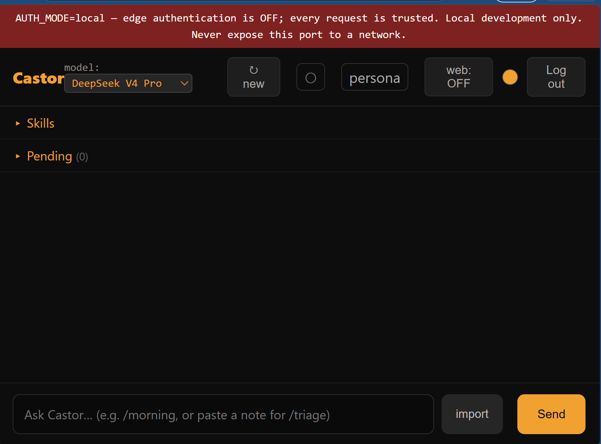

# Castor - a generic, deterministic-first AI agent



Castor is the application layer of a structural twin of a first-generation
personal AI operations platform: an isolated, auditable agent whose scripts and
skills are implemented and tested, with every state and knowledge directory
empty by design so a fresh deploy stands up clean and generic. It carries no
data and no behavioral content of the original - only the shape.

The agent code lives in `scaffold/`. It is deployed as a fleet profile by
**fleet** (Bicep + user-assigned managed identity):
https://github.com/marcusmayo/fleet

A self-contained **Terraform** deployment of the same twin (one `apply`, three
providers, pushes this scaffold into its own repo) is preserved separately at:
https://github.com/marcusmayo/castor-tf-iac

## Run it with a model

Prerequisite: Docker Desktop running (Windows/macOS) or the docker engine
(Linux). The commands are identical on all three, PowerShell included, and one
OpenRouter key is all you need.

```bash
git clone https://github.com/marcusmayo/castor.git
cd castor/scaffold/infra/docker

cp castor.env.example castor.env
#   set OPENROUTER_API_KEY and ANTHROPIC_API_KEY   (both explained below)
#   uncomment AUTH_MODE=local

cp litellm/openrouter.yaml litellm/openrouter.generated.yaml
docker compose --env-file ../versions.lock --profile gateway up -d --build
# open http://127.0.0.1:8443 and send a message
```

What `castor.env` needs — the example file ships with all of it, two blanks to
fill and one line to uncomment:

| variable | what it is |
| --- | --- |
| `OPENROUTER_API_KEY` | your `sk-or-` key. The gateway holds it and spends it; the agent container never sees it. |
| `ANTHROPIC_API_KEY` | what the Claude CLI presents as its own credential. Through the gateway that credential is ignored, so paste the **same** `sk-or-` key here. Paste a real `sk-ant-` key instead if you also want web research or the image-interpret path. |
| `ANTHROPIC_BASE_URL` | already set to `http://gateway:4000` in the example. Castor's compose does not set it, so it lives here; comment it out only if you are running without the gateway profile. |
| `AUTH_MODE=local` | uncomment it, or the page answers 403. Explained at the end of this section. |
| `VISION_API_KEY` | optional. A direct Anthropic key for interpreting images; falls back to `ANTHROPIC_API_KEY`, which must then be a real `sk-ant-` key. |

The `cp` of the gateway table is not decoration. The gateway reads
`openrouter.generated.yaml` — generated from the model table on a real deploy,
and therefore gitignored — and the committed `openrouter.yaml` beside it is the
baseline you put in place. To change a key later, edit `castor.env` and run
`docker compose --env-file ../versions.lock --profile gateway up -d --force-recreate`:
an env file is read when a container is **created**, not when it restarts.

The `--env-file` feeds the repo's pinned versions into the image build — the
build still fails if the vendored core drifts from its manifest. (On the fleet's
own VMs the image is built by `infra/scripts/build-image.sh` instead; this path
is for laptops.)

### The models in this build

Eight, all served through the gateway, exactly as the picker lists them:

| tier | model |
| --- | --- |
| `triage` | glm-5.2 |
| `routine` *(default)* | deepseek-v4-pro |
| `complex` | kimi-k3 |
| `gpt_luna` | gpt-5.6-luna |
| `gpt_terra` | gpt-5.6-terra |
| `claude_haiku` | claude-haiku-4.5 |
| `claude_sonnet` | claude-sonnet-4.6 |
| `claude_opus` | claude-opus-4.8 |

Switch model for a single conversation with the picker in the page header. To
change the default, or point a tier at something else entirely:

```bash
docker exec castor-webchat node scripts/model-routing.js set routine --slug openrouter/<vendor>/<model>
```

That writes the routing table into the state volume, so it survives a restart.
Mirror the same `model_name` and slug into `litellm/openrouter.generated.yaml`
and `docker compose restart gateway`, so the gateway serves what the picker
offers.

### Web research

Real server-side web search exists only at Anthropic, so a web-ON turn leaves
the gateway and goes direct: put a real `sk-ant-` key in `ANTHROPIC_API_KEY`,
toggle **web** in the header, and that turn runs on claude-sonnet-4-6. Web-OFF
turns are untouched.

### About `AUTH_MODE=local`

Production auth is edge-only: Cloudflare Access authenticates and the app 403s
anything that did not arrive through it — right behind a tunnel, a locked door
with no key on a laptop. Local mode is the explicit opt-in, and it opens both
doors: the page and the chat socket. Default-off, only the literal word
activates it, read at request time so an image can never bake it on, and every
page carries a permanent red banner. Never expose that port to a network.
Unset, behaviour is byte-identical to production — a bare request gets 403 —
and tests pin that.

## Architecture

Castor runs as a hardened container agent behind a Cloudflare Tunnel, with the
secrets layer on Key Vault + managed identity (no host-local credentials).

- **Deterministic-first.** Mechanical work - parsing, matching, scoring, YAML
  state - runs in pure Python/Node tools; the model is invoked only for genuine
  semantic ambiguity.
- **Keyless gateway.** Every model call routes through a LiteLLM gateway that
  injects the provider key per call; the agent container holds no upstream key.
- **Egress-gated.** Sensitive content is flagged by a tripwire before it can
  leave; the gate sends only redacted text to the model via `claude -p`.
- **Propose-don't-mutate.** The agent drafts; the operator creates or modifies
  load-bearing state. Deletes are operator-explicit.

```
scaffold/
  gate/          egress tripwire + claude -p spine (redact, audit)
  scripts/       intake, register, digest, model-routing, health, scan-tree, ...
  webchat/       auth + pending panel + interpret actions
  System/        capabilities, model-routing.yaml, pipeline stages, voice
  tests/         fixture tests for the intake / skill lanes
  infra/         Dockerfile, compose, bootstrap (managed-identity first-boot)
  run_e2e.sh     end-to-end acceptance oracle
  clean_demo.sh  reset demo state to a clean agent
```

## Deploy

Castor deploys through the fleet, not from this repo directly. See
**fleet** for the one-command path: `deploy.sh` provisions the VM and
per-agent Key Vault, `set-secrets.sh` sets the operator secrets with shape
validation, and `bootstrap.sh` fetches them via managed identity and brings the
stack up. Run the acceptance oracle on a fresh agent to prove the pipeline:

    docker exec -w /app castor-webchat bash run_e2e.sh --yes

The standalone Terraform twin (single `apply`, remote state, no fleet) lives at
https://github.com/marcusmayo/castor-tf-iac.

## Security posture

- No public IP; deny-all inbound NSG; SSH reachable only through the tunnel and
  bound to localhost.
- No credential values in code. Provider/agent auth is environment- and
  identity-only; operator secrets go straight into Key Vault.
- The agent container is keyless - the LiteLLM gateway injects the upstream key
  per call, and the egress gate flags sensitive content before it leaves.
